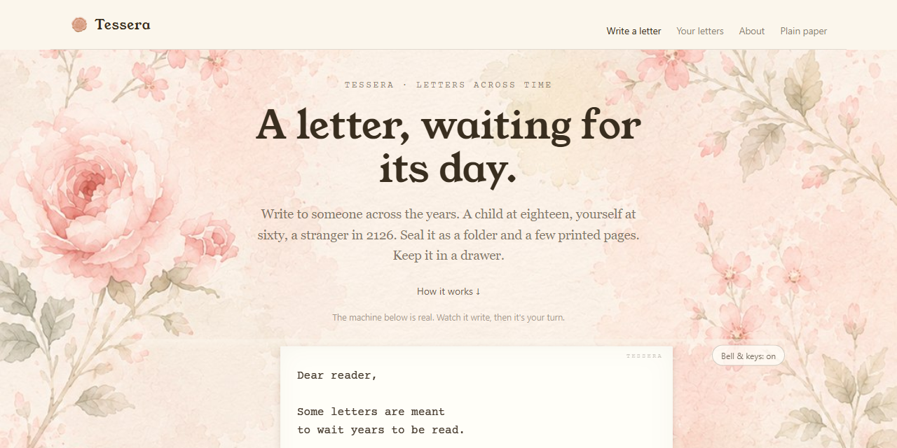

# Tessera — letters across time

**Tessera is an open format, a free tool, and a gentle ritual for writing letters that arrive years or decades from now** — to your child at eighteen, to yourself at sixty, to a stranger in 2126.

> A place where people can store the things we send beyond time — for those who could use a hand and are in need of guidance, and also something to look forward to.

It is named for the *tessera hospitalis*, the token of hospitality from the ancient world: a piece of bone or clay broken in two, one half kept by each party, so that even their descendants — strangers to each other — could reunite the halves and be recognised. Every Tessera letter generates such a token.

## How it works

1. **Write** a letter in the writing room — a quiet, offline-capable page that runs entirely on your device. No account. No server. Nothing leaves your machine.
2. **Seal** it. Tessera produces two things:
   - a **folder of plain files** (the letter, a machine-readable manifest, a human-readable README that explains itself to whoever finds it, checksums, the token art) — keep it anywhere you keep files;
   - a **print kit** — the letter typeset for paper, a cover sheet, an instructions page for the future opener, and the token sheet to cut in two.
3. **Keep** one half of the token. The other half travels with the sealed letter. Decades later, the matching halves tell the opener the letter is real, and tell you the moment has come.

## Why it can outlive everyone involved

Tessera makes no promise that depends on a company, a server, or its author staying alive:

- **Paper is the reference copy.** The printed kit contains everything; the digital folder is the convenience.
- **The format is public domain** (CC0). One letter = one folder of plain text files. Readable in 2126 with no software but patience.
- **The tool is a static page** (source-available, noncommercial). Fork it, mirror it, save it to a USB stick for personal or noncommercial use. It has no build step and no dependencies.
- **Sealing is a ritual, not a lock.** Tessera is honest about this: no cryptography can stop someone opening an envelope early. Custody, promises, and care do that — the way they always have.

## What Tessera is not

No accounts. No cloud storage of your letters. No delivery service that emails your future self — those promises die with the companies that make them. Tessera's only moving part is you, and the people you trust to carry a letter forward.

## Start here

- Open the front door: **[tessera-letters.netlify.app](https://tessera-letters.netlify.app/)** — or `index.html` over any local server; it's the same page. The plain-paper writing room is [`app.html`](https://tessera-letters.netlify.app/app.html); both seal through the same path.
- Read the format: [SPEC.md](SPEC.md) — public domain, ~10 minutes.
- Read the docs: [docs/README.md](docs/README.md) — the project canon and roadmap.

## Licence

Code: [PolyForm Noncommercial 1.0.0](LICENSE) — free to use, study, modify, and share for any noncommercial purpose; commercial use requires a separate license from the author. The Tessera **format** (SPEC.md, docs/spec/, the README template): **CC0 1.0** — public domain, forever. A format that must outlive its author cannot belong to her.

---

*Tessera is a Lacunae project — a sibling, in spirit, to [Perpetūra](https://perpetura.netlify.app): where Perpetūra is fiction about a feeling that crosses centuries, Tessera is the real instrument.*
